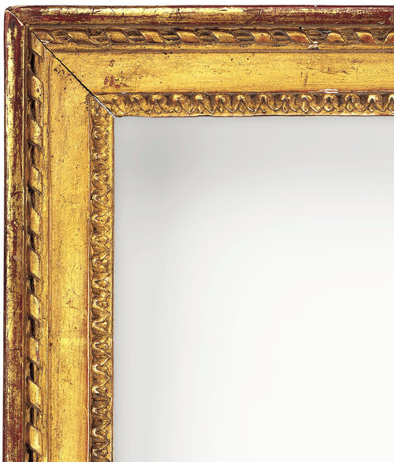
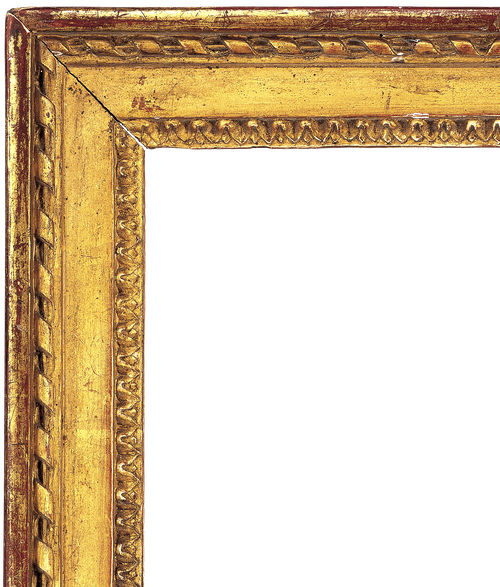
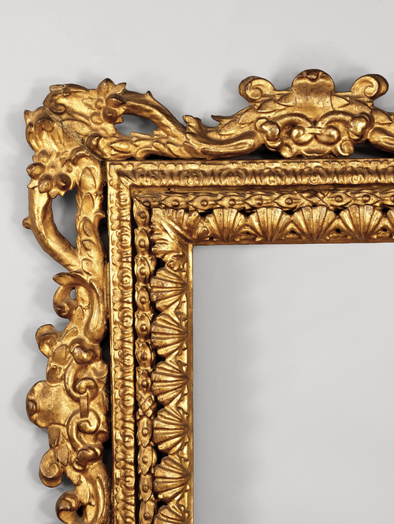
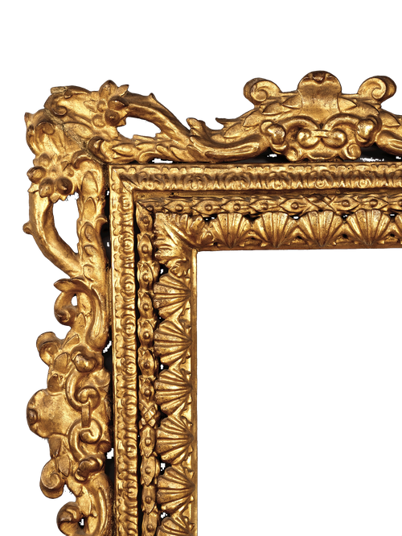

# artgallery-wallpaper

> A python application that generates framed wallpapers from artwork

I wanted to recreate the look of framed artwork in a gallery on my computer desktop. This application takes one (or a bunch) of images and a frame style and generates desktop wallpapers that look like framed artwork on a gallery wall.

## Features

### Background Removal

This tool includes a powerful feature for removing plain, grayscale backgrounds (like white, gray, or black) from images. It's particularly useful for isolating subjects like paintings, frame corners, or other objects from their unicolor backdrops. The script uses color-space masking to intelligently separate the colorful foreground from the less saturated background, making it effective even with subtle shadows and gradients.

#### Before and After

Here’s a quick look at what the background removal script can do:

| Before | After |
| :---: | :---: |
|  |  |
|  |  |

> [!NOTE]
> The output images are saved with a transparent background in `.png` format.

### Usage

To use the background removal tool, run the following command in your terminal:

```bash
python src/artgallery-wallpaper/background_removal.py --image-path /path/to/your/image.jpg
```

You can also process an entire directory of images at once by pointing to a folder instead of a single file and adding the `--batch` flag:

```bash
python src/artgallery-wallpaper/background_removal.py --image-path /path/to/your/images/ --batch
```

### Parameters

You can customize the background removal process with these options:

| Parameter | Description | Default |
| :--- | :--- | :---: |
| `--image-path` | The path to the input image or a directory of images. | (Required) |
| `--saturation-threshold` | Controls how much color a pixel needs to be kept. Lower values are stricter and may remove more of the background, while higher values are more lenient. | `40` |
| `--open-kernel-size` | Helps remove small, isolated pixels of noise from the foreground. Increase this value if you see small dots of background color remaining. | `3` |
| `--close-kernel-size` | Helps fill in small holes or gaps in the main subject. Increase this if parts of your subject are being incorrectly removed. | `7` |
| `--output-path` | The location to save the processed image(s). If not specified, the new file will be saved in the same directory as the original, with `.no_bg.png` added to the name. | `None` |
| `--batch` | Process all images in the specified directory. | `False` |
